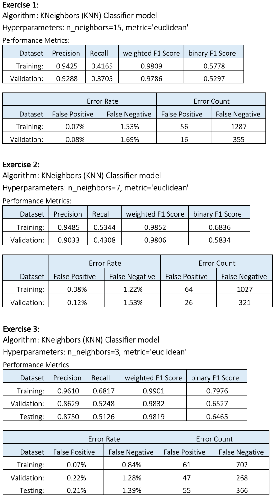
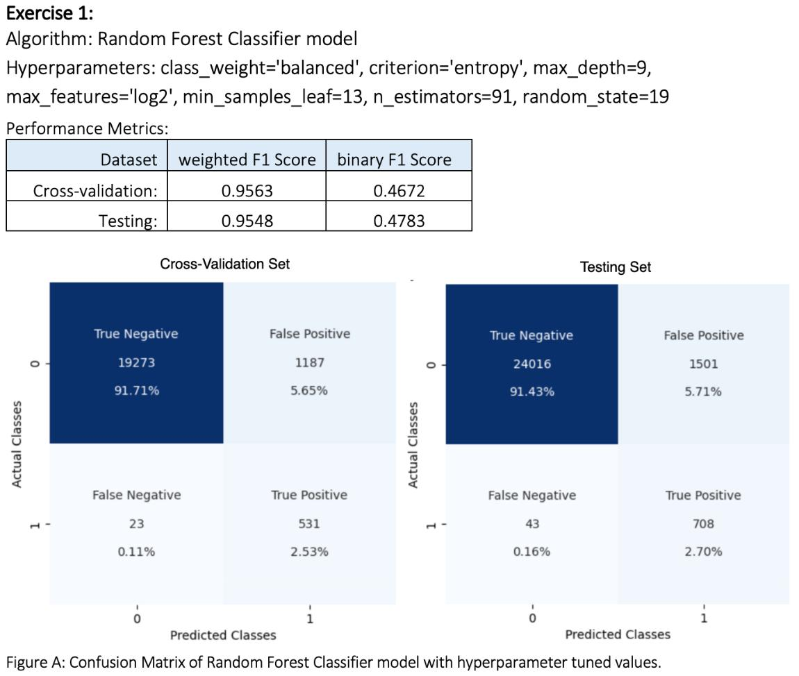

## **Machine Learning: Leveraging Data for Customer Insights to Optimize Marketing Strategies with Customer Repurchase Prediction.**

### **<u>Project Overview</u>**

The primary goal of this project is to build a binary classifier model
to predict whether an existing customer is more likely to buy a new
vehicle. By analysing a dataset containing various attributes of
customer car purchases and services, we aim to develop a model that
accurately identifies potential buyers. This model will be useful for
targeting leads in marketing campaigns, enhancing customer retention,
and optimizing promotional strategies.

### **<u>Business Problem</u>**

The business problem addressed by this project is to predict which
customers are likely to purchase a new vehicle. Accurately predicting
customer repurchase behaviour can help the retailer target potential
buyers with personalized marketing campaigns and optimize inventory and
sales strategies.

Thus, developing a Binary Classifier model that can predict customers
who are likely towards purchasing a new vehicle, by working on a dataset
of car repurchases using Binary Classification techniques and algorithm.

### **<u>Datasets</u>**

The dataset used for this project is named repurchase\_training.csv and
contains information about current customers who have bought one or more
vehicles. Below is a summary of the features in the dataset:

-   **ID**: Unique ID of the customer.

-   **target**: The target variable. A value of 1 indicates the customer
    has purchased more than one vehicle, while 0 indicates a single
    purchase.

-   **age\_band**: Customer's age categorized into bands.

-   gender: Gender of the customer (Male, Female, or Missing).

-   **car\_model**: The model of the vehicle purchased (18 different
    models).

-   **car\_segment**: The type of vehicle purchased.

-   **age\_of\_vehicle\_years**: Age of the customer's last vehicle, in
    deciles.

-   **sched\_serv\_warr**: Number of scheduled services under warranty,
    in deciles.

-   **non\_sched\_serv\_warr**: Number of non-scheduled services under
    warranty, in deciles.

-   **sched\_serv\_paid**: Amount paid for scheduled services, in
    deciles.

-   **non\_sched\_serv\_paid**: Amount paid for non-scheduled services,
    in deciles.

-   **total\_paid\_services**: Total amount paid for services, in
    deciles.

-   **total\_services**: Total number of services, in deciles.

-   **mth\_since\_last\_serv**: Number of months since the last service,
    in deciles.

-   **annualised\_mileage**: Annualized vehicle mileage, in deciles.

-   **num\_dealers\_visited**: Number of different dealers visited for
    servicing, in deciles.

-   **num\_serv\_dealer\_purchased**: Number of services at the dealer
    where the vehicle was purchased, in deciles.

## **<u>Data Preparation</u>**

-   **Determining identifiers and categorical features.**

Figure 1: Dataset highlighting missing values and categorical features.

The car repurchase dataset contains multiple fields that provide
information related to the model of the vehicle, the vehicle's category,
the annual mileage, the age of the previous vehicle, various details
regarding servicing, as well as the gender and age range of the car
owners. All the features are of numerical and categorical type.

-   **Handing missing/null values.**

The chart from Figure 2, indicates that only two variables, 'age\_band'
with around 85% and 'gender' with over 50% contain missing values.
However, there are no missing values for the rest of the features.

-   **Accessing if imbalance targets classes.**

After preparing the data, any missing data and individual identities
were eliminated, and the quality of the data was suitable for usage by
the binary classification algorithm. Additionally, prior to proceeding
it is essential to verify if the data is biased towards certain groups
or individuals, leading to unfair discrimination and measures must be
implemented to ensure the protection of the data as it involves
customers' information about purchasing behaviour.

## **<u>Modelling</u>**

Considering the business objective of determining potential customers
leads for a marketing campaign, there is no good theory to map and
select a suitable algorithm for this binary classification problem,
therefore performing different experiments to discover which algorithm
and algorithm configuration results in the best performance for this
binary classification task.

**Binary Classification Algorithm:**

The target variable consists of either 0 or 1, where 0 represents the
purchase of a single vehicle by the customer, while 1 represents the
purchase of multiple vehicles. As we aim to predict only these two
possible classes outcome, the Binary Classification model is the right
choice along with the learning objective purpose.

As part of the learning process, below are the Classifier models built,
trained, and tested for this binary classification problem.

Figure 4: Algorithms employed, hyperparameters and techniques applied in
the experiments.

## **<u>Evaluation</u>**

Note: Detailing explanations
only for the decent model from each experiment and to obtain a
comprehensive understanding of the performance of each model, kindly
refer to its respective Experiment Reports.

### **A\] Experiment 1: K-Nearest Neighbors**

-   All the 3 binary classification algorithms, employing KNeighbors
    (KNN) Classifier model with different n\_neighbors (15, 7 and 3)
    values, are not sufficiently generalized and there are still
    features with observations that are specific, leading to
    overfitting. Thus, the model is not accurate enough to be useful for
    predicting customer who are likely to purchase a new vehicle.

-   Moreover, there are considerable amount of False Negative errors,
    indicating that the model is misclassifying customer who are likely
    to purchase a new vehicle as not willing to purchase leading to
    missed opportunities for sales and revenue and potentially resulting
    in the failure to meet marketing campaign objectives or targets.

-   Despite the optimal use of 'k' neighbors value of 3 which was
    derived through cross-validation using the cross\_val\_score()
    function, it does not guarantee the best performance and the model
    was significantly overfitting. Additional analysis is required to
    ensure that the model can be more generalized.

### **B\] Experiment 2: Logistic Regression**

-   The logistic regression algorithm with default hyperparameters
    (exercise 1) had a Recall score of 0.2189 for training and 0.2340
    for validation, indicating that the model may miss some potential
    customers who are likely to purchase a new vehicle along with a huge
    number of False Negative errors.

-   Applying regularization techniques such as l1, l2 and elasticnet,
    has led to a significant reduction in False Negative errors
    representing some customers who are likely to purchase new vehicles
    are being overlooked, with 291 for training, 67 for validation and
    108 for the testing set, as opposed to the initial model which had
    1723 for training and 432 for validation sets.

-   However, the regularization has significantly dropped binary F1
    Score, indicating that the model is not performing well in
    identifying customers who are likely to purchase a new vehicle which
    could lead to the loss of chances to make sales and earn revenue,
    and may also result in failure to achieve marketing campaign goals
    or objectives.

-   Therefore, the Logistic Regression Classifier models from these 4
    exercises, are not sufficiently generalized to accurately predict
    customers who are likely to purchase a new vehicle.

### **C\] Experiment 3: Decision Tree**

-   Among all the models from the exercises, the Decision Tree
    classifier binary classification model from the 3rd exercise is
    justifiable with low False Negative errors are 93, 35 and 52 for the
    training, validation and testing set respectively. This indicated
    that the model is misclassifying less amount of customers as not
    interested in purchasing a new vehicle.

-   Additionally, the binary F1 Score resulting in the classifications
    that belong to the positive class are almost similar across all the
    sets, with 0.4174 for training, 0.4083 for validation and 0.4262 for
    testing suggesting that the model is correctly identifying potential
    customers for buying a new vehicle, while misclassifying some
    negative instances as positive.

-   Employing hyperparameters tuned values does not necessarily
    guarantee optimal performance of the model. Further investigation is
    required, including testing the model with various hyperparameter
    combinations of values that could lead to the lowest possible
    errors, and ensure that the model can generalize better on unseen
    data.

-   Additionally, it is essential to take into account the business
    context and benchmarks while conducting machine learning experiments
    to assess the model's performance and work out whether it is
    worthwhile to proceed with additional analysis.

### **D\] Experiment 4: Random Forest**

-   The Random Forest Classifier model from 2nd exercise, utilizing
    hyperparameters tuned values resulted in 0.3971 for cross-validation
    and 0.4098 for the testing set, illustrating that the model has
    overcome the problem of overfitting and is performing consistently
    across all sets and capturing underlying patterns and buying
    behaviours of the customers.

-   The False Negative error rate is 0.10% for cross-validation sets and
    0.16% for testing, which is considerably low informing that model is
    making fewer mistakes for customers that are willing to purchase new
    vehicles.

-   However, there is a relative rise in False Positive errors, which
    indicate customers being wrongly classified as potential buyers of a
    new vehicle, but this would not have a significant impact on the
    company's expenses.

#### **Feature Importance:**

-   Even though the features car\_model and car\_segment seemed to
    contain important information about the type and category of
    vehicles that customers had bought, they had the lowest significance
    and contributed the least to predicting the target classes.

-   Additionally, the rest of the features (except those related to car
    models and segments) are influencing most for prediction of target
    class 1 representing the customers that are likely to purchase a
    vehicle or class 0 of not interested and their feature's importance
    rate ranges between 0.02% to 0.19%.

### **E\] Experiment 5: Random Forest**

-   By utilizing only significant features that are contributing most to
    the prediction of target classes, the model’s performance has
    enhanced to some extent.

-   The binary F1 Score of 0.4672 for training-validation and 0.4783 for
    testing has improved indicating that the model is correctly
    identifying potential customers for buying a new vehicle while
    misclassifying some negative instances as positive.

-   The False Negative errors are low, with 23 for Training-Validation
    and 43 for Testing which indicates that the model is misclassifying
    less amount of customers as not interested in purchasing a new
    vehicle while in actual those who are interested.

### **F\] Experiment 6: Extra Trees**

-   The binary F1 Score for the result classes with the positive label,
    for the training-validation set is 0.3444, and for the testing set
    is 0.3507 informing that overall, the model has learned the general
    patterns from the training set and is behaving steadily for all the
    sets and is correctly identifying potential customers for buying a
    new vehicle.

-   Moreover, the confusion matrix shows a decreased number of False
    Negative errors, which are 15 for training-validation and 31 for
    testing notifying that the model is misclassifying a small number of
    customers as unlikely to purchase a new vehicle.

## **<u>Model Summary and Business Suggestions:</u>**

After considering the business objective of identifying potential
customers who are likely to purchase a new vehicle and assessing the
performance and effectiveness of all developed algorithms in these
experiments, it has been determined that the Random Forest Classifier
algorithm build in the 5th experiment is the most suitable.

The Random Forest Classifier model utilised only significant features
that are contributing most to the prediction of target classes derived
from Feature Importance and applied fine-tuned hyperparameters obtained
from tuning hyperparameters.

The False Negative error rate is 0.11% (23) for cross-validation sets
and 0.16% (43) for testing, which is

considerably low illustrating that the model is making fewer mistakes
for customers that are willing to purchase new vehicles.

The binary F1 Score representing the classifications that belong to the
positive class scores 0.4672 for training-validation and 0.4783 for
testing indicating the model is behaving steadily for all the sets and
is correctly identifying potential customers for buying behaviour.

As the binary F1 Score is consistently performing across all the data
and could accurately predict almost 50% of the instances of customers
who are likely to buy new vehicles would be valuable for business. The
outcomes generated by this model can subsequently be utilized to focus
on potential customers for a marketing campaign.

With the information generated by the model, the marketing team could
focus their efforts and resources on those potential customers which can
lead to an effective and efficient promotional campaign by generating
desired results and sales figures.

Moreover, they could employ alternative methods, such as conducting
manual analysis at the same time, in order to increase sales. Therefore,
this model could be implemented in an operational environment,
considering that there's potential for improving sales numbers by
simultaneously utilizing alternative methods.

###  **Prerequisites**

-   Python 3.7+

-   TensorFlow 2.x

-   Keras

-   scikit-learn

-   OpenCV

-   Matplotlib

• The structure of the project directory is as below.

<small>Project based on the <a target="_blank" href="https://drivendata.github.io/cookiecutter-data-science/">cookiecutter data science project template</a>. #cookiecutterdatascience</small>

Project Structure
------------

    ├── LICENSE
    ├── Makefile           <- Makefile with commands like `make data` or `make train`
    ├── README.md          <- The top-level README for developers using this project.
    ├── data
    │   ├── external       <- Data from third party sources.
    │   ├── interim        <- Intermediate data that has been transformed.
    │   ├── processed      <- The final, canonical data sets for modeling.
    │   └── raw            <- The original, immutable data dump.
    │						      repurchase_training.csv
    │
    ├── docs               <- A default Sphinx project; see sphinx-doc.org for details
    │
    ├── models             <- Trained and serialized models, model predictions, or model summaries
    │
    ├── notebooks          <- Jupyter notebooks specified below. 
    │                         		 MachineLearning_K-NearestNeighbors_Exp1.ipynb
    │                                MachineLearning_LogisticRegression_Exp2.ipynb
    │                                MachineLearning_DecisionTree_Exp3.ipynb
    │                                MachineLearning_RandomForest_Exp4.ipynb
    │                                MachineLearning_RandomForest_Exp5.ipynb
    │                                MachineLearning_ExtraTrees_Exp6.ipynb
    │                         
    │
    ├── references         <- Data dictionaries, manuals, and all other explanatory materials.
    │
    ├── reports            <- Generated experiment and analysis PDF reports as below.
    │                                EXPERIMENT REPORT 1 - K-NearestNeighbors.pdf
    │                                EXPERIMENT REPORT 2 - LogisticRegression.pdf
    │                                EXPERIMENT REPORT 3 - DecisionTree.pdf
    │                                EXPERIMENT REPORT 4 - RandomForest.pdf
    │                                EXPERIMENT REPORT 5 - RandomForest.pdf
    │                                EXPERIMENT REPORT 6 - ExtraTrees.pdf
    │                                Final Project Report.pdf
    │
    ├── requirements.txt   <- The requirements file for reproducing the analysis environment, e.g.
    │                         generated with `pip freeze > requirements.txt`
    │
    ├── setup.py           <- makes project pip installable (pip install -e .) so src can be imported
    ├── src                <- Source code for use in this project.
    │   ├── __init__.py    <- Makes src a Python module
    │   │
    │   ├── data           <- Scripts to download or generate data
    │   │   └── make_dataset.py
    │   │
    │   ├── features       <- Scripts to turn raw data into features for modeling
    │   │   └── build_features.py
    │   │
    │   ├── models         <- Scripts to train models and then use trained models to make
    │   │   │                 predictions
    │   │   ├── predict_model.py
    │   │   └── train_model.py
    │   │
    │   └── visualization  <- Scripts to create exploratory and results oriented visualizations
    │       └── visualize.py
    │
    └── tox.ini            <- tox file with settings for running tox; see tox.readthedocs.io

--------
